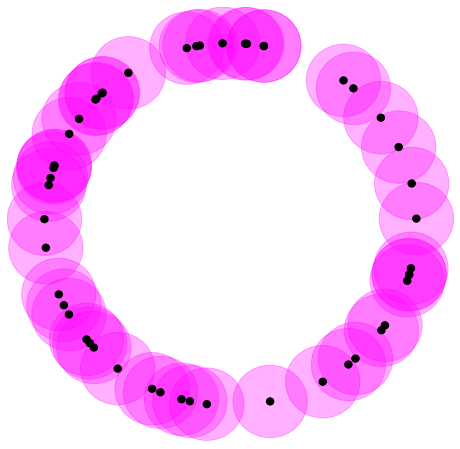

# Topological Data Analysis

Repository with information about the course Topological Data Analysis with Persistent Homology. 

Professor [Rapha¨el Tinarrage](https://raphaeltinarrage.github.io/)

Course website: [https://raphaeltinarrage.github.io/EMAp.html](https://raphaeltinarrage.github.io/EMAp.html)

Course notes: [SummerCourseTDA](https://raphaeltinarrage.github.io/files/EMAp/SummerCourseTDA.pdf)

Exercises and main definitions: [notes](https://lucasmoschen.github.io/files/disciplines/topological-data-analysis/exercises.pdf)

# Table of Contents

- [Topological Data Analysis](#topological-data-analysis)
- [Table of Contents](#table-of-contents)
  - [Abstract](#abstract)
  - [How to use](#how-to-use)
  - [Tutorials](#tutorials)
    - [Tutorial 1](#tutorial-1)
    - [Tutorial 2](#tutorial-2)

Abstract
---

This is a topic from applied mathematics with the objective of analyze
datasets using techniques from topology. This framework is insensitive to a
particular metric and provides dimensionality reduction and robustness to
noise. In this course, we aim to understand the basic topological concepts as
topological space and apply it using Python. The tutorials are written by the
professor. 

How to use 
---

For running this project you'll need: 

1. [Clone](https://git-scm.com/docs/git-clone) this repository in your
   machine. 
2. Install
   [Anaconda](https://docs.conda.io/projects/conda/en/latest/user-guide/install/linux.html),
   [Python](https://docs.python-guide.org/starting/install3/linux/) and
   [JupyterLab](https://jupyter.org/install). 
3. Create the environment with the same `enviroment.yml`file. [More details](https://docs.conda.io/projects/conda/en/latest/user-guide/tasks/manage-environments.html#creating-an-environment-from-an-environment-yml-file).

After that, enter in the jupyter environment and run the notebooks as you
wish. 

Tutorials 
---

### Tutorial 1

In this tutorial, we implement the concept of triangulation of topological spaces. It's a simplicial complex homeomorphic to the space. This simplicial complex is a combinatorial representation with finite points. For instance, the representation of a triangle graph is a triangulation of the circle. Here we use the library [NetworkX](https://networkx.org/) to draw the graph representation. 

We can also represent the torus triangulation. 

After these, with the library [GUDHI](https://gudhi.inria.fr/), we can calculate the number of connected componentes and the Euler characteristic. We can see the behaviour of these characteristics in the Erdős–Rényi graph. 

### Tutorial 2 

Were we study the concept of Homology, t-thickening and the Betti curves, that
are related, with "holes" in each dimension. For example, $\beta_0$ indicates
the number of connected components, $\beta_1$ the number of circular holes and
$\beta_2$ empty volumes. In the practice, we only have a finite number of
points in some space and with topology inference one can understand the
homology of these points. For example, consider some points of the circle and
its thickening with $t = 0.2$.

 

Observe with that value we have one connected component, but does not have a
hole. Therefore it's homotopy equivalent to a point. Below we see the first
Betti Curve of an a series of data points with a lot of noisy. For each $t$ we
calculate the Betti Number of a triangulation of the t-thickening. We can
infer the real first Betti number is 2. 

We also consideres two interesting datasets: one with images and another with
proteins. Please see the notebooks for more details. 